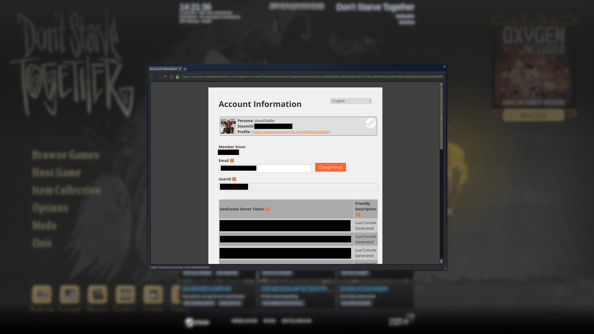

# Cluster Token Generation

_The definitive guide on how to generate a cluster token for your Don't Starve Together dedicated server._

There are two main ways a cluster token can be generated. While both ways are in-game (you need to launch the game client), one is done via typing in a console command, while the other is done via GUI.

For this project, the `cluster_token.txt` file is located in `DSTClusterConfig/cluster_token.txt`.

> :closed_lock_with_key: This file **must** be generated based on your Steam account. The account that generates the token automatically gains **admin** access in-game, meaning you can rollback, regenerate the world or use console commands while playing.

## Via console command

Enter the game and press "Play". After you're logged in, bring up the console (by pressing `~`) and type the following command:

```
TheNet:GenerateClusterToken()
```

Press enter. The console will go away, and a `cluster_token.txt` was generated in:
 - Unix: `~/.klei/DoNotStarveTogether`
 - Windows: `C:\Users\<username>\Documents\Klei\DoNotStarveTogether`

 Get the generated file and **override** `DSTClusterConfig/cluster_token.txt` with it.

## Via "Account" interface

Open the game and press "Play".


On the bottom left of the screen, click "Account". This will bring up information about your Klei Account.


You'll see your account information along with a list of all the Cluster Tokens your account ever generated in any way (console command, hosting a local server, etc).



Scroll to the bottom and you'll see a "Generate Server Token" button. You can add a "friendly name" for it so you can remember what it was created for.


The newly generated token will show up in the list along with the name you gave it. Open `DSTClusterConfig/cluster_token.txt`, **erase** it completely and paste the token in the file. Make sure to not leave any extra spaces or blank lines.
